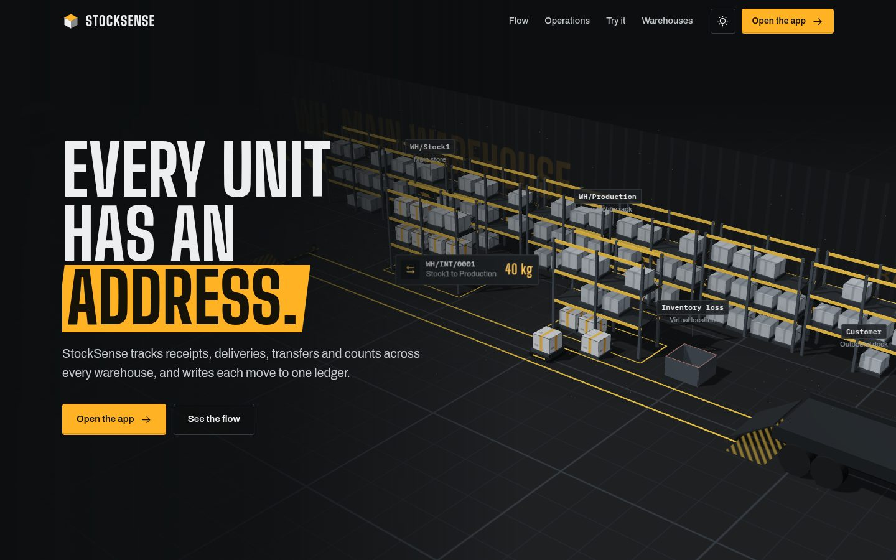
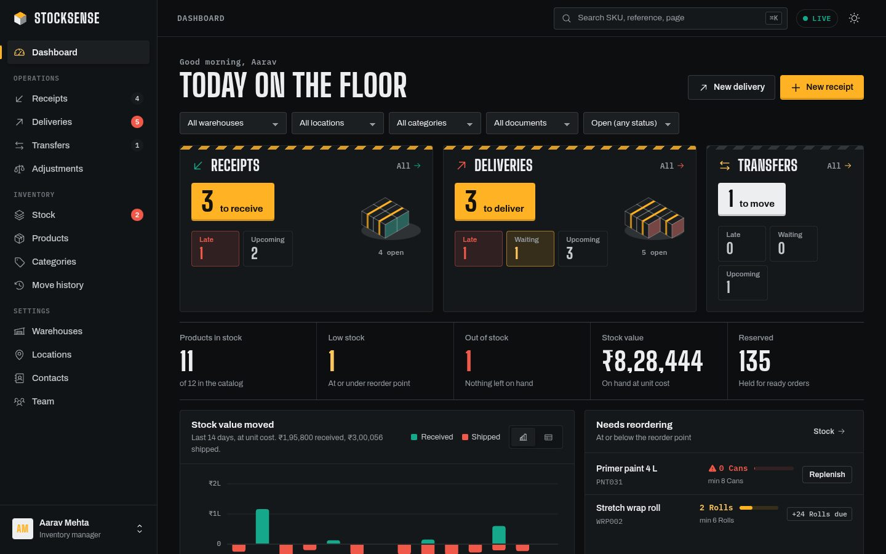
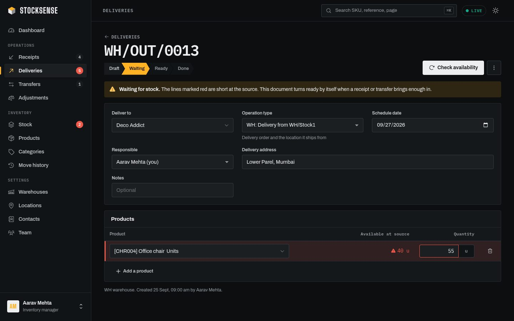
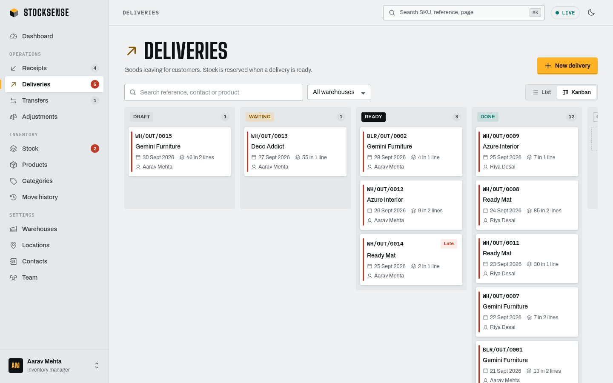
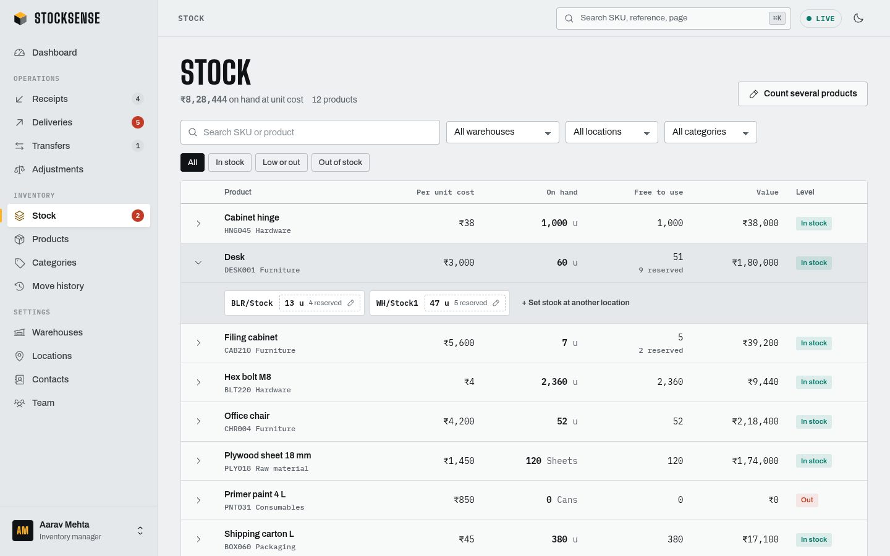

# 

**Every unit has an address.** StockSense is a modular inventory management system that replaces registers and spreadsheets with one live ledger: receipts, deliveries, internal transfers and stock counts across every warehouse, rack and bay.



It is built on the inventory model Odoo uses (internal and virtual locations, stock quants, pickings, an append-only move ledger) and follows the StockSense problem statement and mockup screen by screen.

Website: https://stocksense.scriptjacker.in/

---

## What is inside

| | |
|---|---|
| **Landing page** (`/`) | A scroll-driven Three.js warehouse that plays the brief's own example: receive 100 kg of steel, move 40 kg to the production rack, deliver 20 kg, write off 3 kg. A working in-page stock board, the four document types as shipping labels, a SKU finder. |
| **Web app** (`/app`) | React SPA: dashboard, receipts, deliveries, transfers, adjustments, stock, products, move history, warehouses, locations, contacts, team, profile. Light and dark, phone to desktop, live across tabs and users. |
| **API** (`/api`) | Express + PostgreSQL. Multi-company workspaces isolated by row-level security, operations engine with reservations, per-warehouse references, email verification and password reset by code or link, SSE live updates. |

### Beyond the brief

- **Every sign-up is its own company.** A new account creates a private workspace and becomes its inventory manager; teammates join by email invitation (Team page) and set their own password from the link. Isolation is enforced by **PostgreSQL row-level security** on every table, plus composite foreign keys `(company_id, id)` so a guessed id from another company can never be referenced. The server refuses to start if the database user could bypass it.
- **Email you can trust.** Sign-in is blocked until the email is confirmed with a 6-digit code *or* a one-time link (same email). Password reset works the same way. Codes and link tokens are stored only as HMACs, codes expire in 10 minutes and lock after 5 wrong tries, resends have a cooldown, and every password change sends a notice.
- **One-click live demo.** "Try a live demo workspace" creates a private copy of the sample company (two warehouses, 12 products, three weeks of history) in under a second. Each visitor gets their own, so nobody steps on anyone else; sandboxes delete themselves after 24 hours.

### Mapped to the brief

- **Authentication**: sign up (creates your company), email verification, sign in, password reset by OTP or link, redirect to the dashboard. Signup rules from the mockup: Login ID unique and 6 to 12 characters, email unique, password with lowercase, uppercase, a special character and more than 8 characters. A failed sign-in always says *"Invalid Login Id or Password"*.
- **Dashboard KPIs**: products in stock, low / out of stock, pending receipts, pending deliveries, internal transfers scheduled. Receipt and delivery cards show *N to receive / to deliver*, **Late** (scheduled before today), **Waiting** (short of stock) and **Upcoming** (scheduled after today), exactly as the mockup defines them.
- **Dynamic filters**: document type, status, warehouse or location, product category. One row, scoping every number on the page.
- **Products**: name, SKU, category, unit of measure, unit cost, optional initial stock (booked as an adjustment so it shows in the ledger), reordering rules (min / max) with low-stock alerts and one-click replenishment.
- **Receipts**: Draft → Ready → Done. *To Do* confirms, *Validate* adds stock. Print once done.
- **Delivery orders**: Draft → Waiting → Ready → Done. Stock is reserved when ready; lines turn red with an alert when a product is short; a waiting order turns ready **by itself** as soon as a receipt or transfer brings enough stock.
- **Internal transfers**: Rack A → Rack B, warehouse to warehouse. Totals stay the same, locations change.
- **Stock adjustments**: pick a location, enter counted quantities, the system posts the difference. The Stock page edits counts inline, per location ("user must be able to update the stock from here").
- **Move history**: every product line of every document, green for stock in, red for stock out, list or kanban by status, searchable by reference and contact.
- **Settings**: warehouses (name, short code, address) and locations (name, short code, warehouse).
- **References**: `<Warehouse>/<Operation>/<ID>`, for example `WH/IN/0001`, `WH/OUT/0014`, `BLR/INT/0002`, numbered per warehouse and type.

| Dashboard | Delivery waiting for stock |
|---|---|
|  |  |
| **Deliveries kanban (drag to change status)** | **Stock, editable per location** |
|  |  |

---

## Quick start

### With Docker (one command)

```bash
docker compose up --build
```

Open <http://localhost:4000>. The first start migrates the database and loads demo data (two warehouses, 12 products, three weeks of history).

### Local development

Requirements: Node.js 20.11+ and PostgreSQL 14+.

```bash
git clone https://github.com/Divyansh2047/StockSense.git stocksense
cd stocksense
npm ci

# database (any Postgres works; these match .env.example)
createuser -P stocksense            # password: stocksense
createdb -O stocksense stocksense
createdb -O stocksense stocksense_test

cp .env.example .env                # then set JWT_SECRET
npm run db:seed                     # migrate + demo data
npm run dev                         # API on :4000, app on :5173
```

Open <http://localhost:5173> for the landing page and <http://localhost:5173/app> for the app. Vite proxies `/api` to the API.

### Demo

The fastest way in: **Try a live demo workspace** on the sign-in page. Or use the seeded sample company:

| Login ID | Password | Role |
|---|---|---|
| `manager` | `Stock@2026!` | Inventory manager |
| `picker01` | `Stock@2026!` | Warehouse staff |

The demo data is set up to show the interesting cases: a late receipt, a delivery **waiting** for 55 chairs with 40 on hand (validate today's chair receipt and watch it turn ready), a low-stock and an out-of-stock product. In development the verification and reset screens show the code on screen; production only emails it.

---

## Deploy

### Render (free, recommended)

1. Render dashboard, **New, Blueprint**, pick this repository. `render.yaml` creates the Docker web service and a PostgreSQL 16 database and generates `JWT_SECRET`.
2. Fill in `APP_URL` (for example `https://stocksense.scriptjacker.in`), `MAIL_FROM` and one of `RESEND_API_KEY` / `BREVO_API_KEY`. Render's free plan blocks SMTP ports, which is why the HTTPS email APIs exist.
3. Optional custom domain: add it under the service's **Settings, Custom Domains**, then point a `CNAME` at the `onrender.com` host Render shows.

Free services sleep after 15 idle minutes; a cron job hitting `/api/health` every 10 minutes keeps the demo instant.

### Any server with Docker (VPS, EC2, Azure VM)

```bash
git clone https://github.com/Divyansh2047/StockSense.git && cd StockSense
export JWT_SECRET=$(openssl rand -base64 48) APP_URL=https://your.domain
# plus MAIL_FROM and SMTP_* (for example smtp.hostinger.com:465) or RESEND_API_KEY
docker compose up -d --build
```

Put it behind a TLS proxy (Caddy, nginx) and drop `COOKIE_SECURE: "false"` from `docker-compose.yml` once it serves https.

---

## Tech stack

| Layer | Choice |
|---|---|
| Frontend | React 19, TypeScript, Vite 7, React Router 7, TanStack Query 5, Motion 12, Three.js, Phosphor icons, hand-written CSS design tokens, self-hosted fonts (Big Shoulders Display, Archivo, IBM Plex Mono) |
| Backend | Node.js 22, Express 5, TypeScript, Zod validation, `pg`, bcrypt, JWT in an httpOnly cookie, Helmet, express-rate-limit, Pino, Nodemailer |
| Database | PostgreSQL 16 (plain SQL migrations, no ORM) |
| Realtime | Server-sent events: every write broadcasts the topics it touched and open tabs refetch just those queries |
| Tests | Vitest + Supertest against a real Postgres (31 integration tests), Playwright end-to-end smoke test (16 checks) |
| Delivery | Multi-stage Dockerfile (non-root, healthcheck), docker-compose, GitHub Actions CI |

---

## How stock works

```
Vendors ──receipt──▶ WH/Stock1 ──transfer──▶ WH/Production ──delivery──▶ Customers
                                                    │
                                                    └──adjustment──▶ Inventory adjustment
```

- **Locations** are *internal* (belong to a warehouse, hold stock) or *virtual* (Vendors, Customers, Inventory adjustment), which only ever appear as the other side of a move.
- **Stock quants** hold the on-hand and reserved quantity of a product at an internal location. `free to use = on hand - reserved`. Database constraints guarantee `0 <= reserved <= on hand`.
- **The ledger** (`stock_moves`) is append-only. Every validated line writes one row with from, to, quantity, unit cost, user and time, so "what happened and where it went" is always answerable.
- **Reservations** are all or nothing: a delivery either holds everything it needs (Ready) or nothing (Waiting), so a half-reserved order never blocks stock another order could ship. When stock arrives, waiting documents are re-checked oldest first. A count that drops stock below what is reserved pulls reservations back from the newest ready orders.
- Quants are always locked in product order inside a transaction, so concurrent validations cannot deadlock or oversell.

| Document | Lifecycle | On validate |
|---|---|---|
| Receipt | Draft → Ready → Done | on hand + qty at destination |
| Delivery | Draft → Waiting / Ready → Done | on hand − qty and reservation released at source |
| Internal transfer | Draft → Waiting / Ready → Done | source − qty, destination + qty |
| Adjustment | Draft → Done | counted quantity replaces on hand, difference logged |

Any open document can be canceled; drafts and canceled documents can be deleted.

---

## Project structure

```
.
├── index.html                  landing page (standalone, served at /)
├── backend/
│   ├── db/migrations/          plain SQL, applied in order at boot
│   ├── src/
│   │   ├── app.ts              Express app, security headers, static serving
│   │   ├── config.ts           validated environment
│   │   ├── db/                 pool, migrate, seed, CLI
│   │   ├── lib/                auth, errors, SSE hub, mailer, logger
│   │   └── modules/            auth, catalog, warehouses, partners, users,
│   │                           operations (service + routes), stock, moves, dashboard
│   └── test/                   integration tests
├── frontend/
│   └── src/
│       ├── auth/               sign in / up / reset + three.js scene
│       ├── layout/             app shell, command palette
│       ├── components/         design-system pieces, chart, combobox, dialog
│       ├── pages/              one file per screen
│       ├── lib/                API client, queries, live updates, formatting
│       └── styles/             tokens, components, layout, pages
├── e2e/smoke.mjs               Playwright end-to-end smoke test
├── Dockerfile, docker-compose.yml
└── .github/workflows/ci.yml
```

---

## API

All endpoints are JSON under `/api` and need a session except `auth/*` and `health`. Errors look like `{ "error": { "code", "message", "fields" } }`.

| Area | Endpoints |
|---|---|
| Auth | `POST auth/signup` (creates a company), `POST auth/verify-email`, `POST auth/verify-email/link`, `POST auth/resend-verification`, `POST auth/login`, `POST auth/logout`, `POST auth/demo`, `GET auth/session`, `GET/PATCH auth/me`, `POST auth/change-password`, `POST auth/forgot-password`, `POST auth/verify-otp`, `POST auth/reset-link`, `POST auth/reset-password` |
| Dashboard | `GET dashboard?warehouseId&locationId&categoryId&type&status` |
| Operations | `GET/POST operations`, `GET/PATCH/DELETE operations/:id`, `POST operations/:id/confirm` (To Do), `/check-availability`, `/validate`, `/cancel` |
| Stock | `GET stock?search&warehouseId&locationId&categoryId&stock`, `PUT stock` (set counted quantity, posted as an adjustment) |
| Moves | `GET moves?search&kind&status&direction&productId&locationId&from&to` |
| Catalog | `GET/POST products`, `GET/PATCH/DELETE products/:id`, `POST products/:id/replenish`, `GET/POST/PATCH/DELETE categories` |
| Warehouses | `GET/POST/PATCH/DELETE warehouses`, `GET/POST/PATCH/DELETE locations` |
| Contacts, team | `GET/POST/PATCH/DELETE partners`, `GET/POST users` (invite), `POST users/:id/invite` (resend), `PATCH users/:id/role` |
| Realtime | `GET events` (server-sent events) |
| Health | `GET health` |

---

## Security

- Tenant isolation in the database itself: row-level security policies on every table keyed to the request's company, composite foreign keys across companies, and a startup self-test that refuses to serve if isolation is not in effect.
- Email ownership is verified before the first sign-in (code or single-use link, HMAC-stored, expiring, attempt-limited).
- Passwords hashed with bcrypt; sign-in never reveals whether a Login ID exists (constant-time comparison against a dummy hash).
- Session JWT in an `httpOnly`, `SameSite=Lax` cookie (`Secure` in production). A per-user token version signs out every session on password change or reset.
- OTP reset: 6-digit codes stored as HMACs, single use, 10-minute expiry, locked after 5 wrong tries, same response for unknown emails, short-lived reset token between steps.
- CSRF defence in depth: SameSite cookies, JSON-only writes and an Origin check.
- Rate limits on sign-in, sign-up and reset endpoints.
- Helmet headers with a strict CSP; the landing page's inline scripts are allowed by SHA-256 hash, not `unsafe-inline`.
- Zod validation on every input, parameterised SQL everywhere, database constraints as the last line (quantities never negative, reservations never exceed stock).
- Roles: managers change settings, the catalog and the team; staff run receipts, deliveries, transfers and counts. Whoever creates a company is its first manager.

---

## Testing

```bash
npm test                 # 41 integration tests (needs the stocksense_test database)
npm run typecheck        # backend and frontend
npm run build && npm start
npx playwright install chromium && npm run e2e   # 20 end-to-end checks on seeded data
```

The integration suite runs the brief's worked example end to end (receive 100 kg, transfer 40, deliver 20, write off 3, ledger shows exactly those four moves), plus the waiting / ready logic, reservation hand-over on cancel, counts below reservations, reference numbering per warehouse, every signup rule, email verification by code and link, invitations, demo sandboxes, the OTP flow, and cross-company isolation (another company's ids are invisible and cannot be referenced).

---

## Configuration

| Variable | Default | Purpose |
|---|---|---|
| `DATABASE_URL` | local `stocksense` database | PostgreSQL connection string |
| `JWT_SECRET` | generated | 32+ random characters used to sign sessions and hash codes. If unset in production, the server generates one on first boot and keeps it in the database |
| `PORT` | `4000` | API and static server port |
| `NODE_ENV` | `development` | `production` enables secure cookies and hides dev helpers |
| `COOKIE_SECURE` | `true` in production | set `false` only when serving plain http (local docker) |
| `SEED_DEMO` | `false` | load the sample company on boot when the database has no users |
| `APP_URL` | `http://localhost:5173` | public address used in email links |
| `MAIL_FROM` | `StockSense <no-reply@stocksense.local>` | sender for all email |
| `RESEND_API_KEY` or `BREVO_API_KEY` | empty | send email over HTTPS (works where SMTP ports are blocked) |
| `SMTP_HOST`, `SMTP_PORT`, `SMTP_USER`, `SMTP_PASS` | empty | or send over SMTP (465 uses TLS). With no provider, codes and links are logged |
| `OTP_DEV_ECHO` | `false` | development only: return the code in the API response |
| `CORS_ORIGINS` | empty | extra origins allowed to call the API with cookies |
| `TRUST_PROXY` | `loopback` | Express trust proxy setting: `true`, a hop count, or addresses |

## Scripts

| Command | What it does |
|---|---|
| `npm run dev` | API (watch mode) and Vite dev server together |
| `npm run build` | build the frontend, compile the backend |
| `npm start` | run the compiled server (serves `/`, `/app`, `/api`) |
| `npm test` | backend integration tests |
| `npm run e2e` | Playwright smoke test against a running server |
| `npm run db:migrate` / `db:seed` / `db:reset` | database tasks (`reset` refuses to run in production) |

---

## Roadmap

Barcode and QR scanning on the phone layout, purchase orders feeding receipts, lot and serial tracking, multi-step delivery (pick / pack / ship as separate documents), valuation methods (FIFO, average cost), CSV import and export, audit log of settings changes, and demand forecasting from the ledger.

## How we built it

StockSense was built by Divyansh Singh and Parth Narula with the help of an AI coding assistant. The team set the product direction and requirements, made the architecture and hosting decisions, set up the infrastructure (Render, Hostinger DNS and mail, Resend), and tested every flow on the live site; much of the code was generated with the assistant under our direction.

## Mockup and problem statement

Designed from the StockSense problem statement and its Excalidraw mockup: <https://link.excalidraw.com/l/65VNwvy7c4X/3ENvQFu9o8R>

## Author

**Divyansh Singh** · [github.com/divyansh2047](https://github.com/divyansh2047) · [linkedin.com/in/divyansh2047](https://linkedin.com/in/divyansh2047)
**Parth Narula** [github.com/scriptjacker](https://github.com/scriptjacker) [linkedin.com/in/divyansh2047](https://linkedin.com/in/parth-narula-86283821a)

## License

MIT
